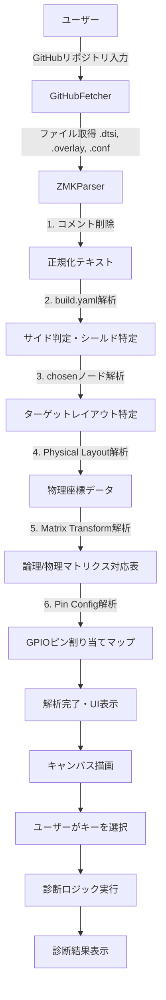
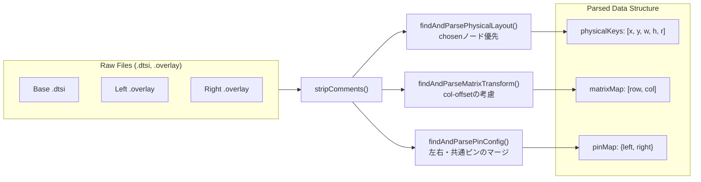
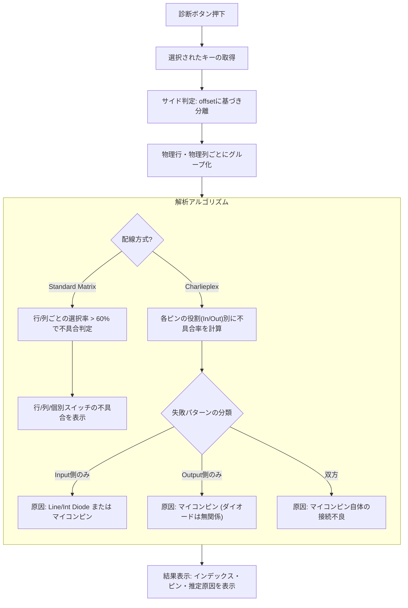

# System Flow Diagram

このドキュメントは、Generic ZMK Debugger の動作フローを説明するものです。

## 1. 全体ワークフロー

## 2. 解析ロジックの詳細 (ZMKParser)

## 3. 診断ロジック (analyzeFailures)

## 4. 特殊な配線方式とダイオードの処理

### 分割キーボード
*   `col-offset` または `row-offset` を超過している場合、「Right Side」として判定。
*   物理的な配線特定のため、オフセットを差し引いた物理座標を使用してピンマップを参照。

### Charlieplex 解析
*   **構造**: 各ピンは「信号受信用 (Input/Row)」と「信号送信用 (Output/Col)」の双方の役割を異なるタイミングで担います。
*   **判定**: ピン単体の動作ではなく、「Inputとしての挙動」と「Outputとしての挙動」を個別に蓄積・解析します。
*   **不具合の分類**:
    1.  **Input側のみ不具合**: そのピンをRowとして使うキーのみ反応しない。
        *   原因: **Line/Int Diode** または マイコンピンの不具合。
    2.  **Output側のみ不具合**: そのピンをColとして使うキーのみ反応しない。
        *   原因: **マイコンピン**の不具合（ダイオードは無関係）。
    3.  **双方で不具合**: そのピンに関わる全てのキーが反応しない。
        *   原因: **マイコンピン自体の接続不良**（半田浮き等）。

### ダイオード不具合の条件
*   **原則**: Line Diode および Int Diode は **Charlieplex 配線方式においてのみ**使用される部品です。
*   **反映**: 通常マトリクスでは無視し、Charlieplex において「Input側の動作不良」が検知された場合のみ、診断結果に候補として表示します。

